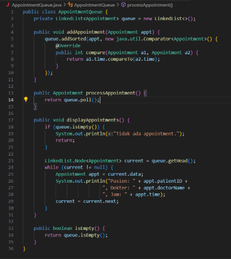

# Penjelasan Program - DAISUKE CLINIC

## Deskripsi Umum

Program “DAISUKE CLINIC” merupakan suatu program yang didesain khusus untuk memudah pendaftaran, manajemen data pasien & dokter, serta digunakan untuk membuat jadwal appointment antara pasien dengan dokter.
Program ini juga bisa dioperasikan oleh admin, dimana admin memliki semua fitur” dari kedua belah pihak yaitu pasien dan dokter untuk mengantisipasi apabila pasien dan dokter tidak bisa menggunakan program ini maka pasien & dokter bisa meminta bantuan oleh admin. Dokter memiliki fitur spesial yang hanya bisa dioperasikan oleh dokter yaitu “Proses Appointment”.
Program ini juga akan mengatur semua antrian appointment & program ini sudah dilengkapi sistem Priority Queue. Program ini juga akan menyimpan semua data” medical record setiap pasien yang memungkinkan kita untuk mengaksesnya kapan saja.


## Bagaimana cara Program berjalan
Program kami menggunakan bahasa pemrograman java yang menggunakan sistem modular file agar mempermudah menjalankan program dengan memecahkan program kompleks menjadi bagian-bagian yang lebih sederhana. Semua data yang diinput saat menjalankan program akan tersimpan ke file dengan format txt

### Class: `Appointment`


Pada program Main.java user diminta untuk menginput pilihan menu antara login, register, atau quit. Di antara login dan register terdapat dua peran, yaitu pasien dan dokter. Secara garis besar class Appointment digunakan untuk mempresentasikan janji temu antara pasien dan dokter.

### Class: `Appointment Queue`


Selanjutnya terdapat class Appointment yang digunakan untuk mengelola antrian dari janji temu yang sudah diatur. Berikut fungsi dari beberapa method yang terdapat pada class AppointmentQueue:
- addAppointment(Appointment appt): menambahkan appointment sesuai dengan urutan waktu yang telah dijadwalkan.
- processAppointment(): Memproses atau menindaki appointment paling awal dari jadwal atau janji pasien ini menggunakan cara kerja queue yaitu FIFO.
- displayAppointments(): Mencetak semua informasi appointment.
isEmpty(): Mengecek apakah antrian sedang kosong atau tidak.


### Class: `BST`
```java
public class BST {
    private Node root;

    private class Node {
        Patient patient;
        Node left, right;

        Node(Patient patient) {
            this.patient = patient;
        }
    }

    public void insert(Patient patient) {
        root = insert(root, patient);
    }

    private Node insert(Node node, Patient patient) {
        if (node == null) return new Node(patient);
        
        int cmp = patient.getID().compareTo(node.patient.getID());
        if (cmp < 0) {
            node.left = insert(node.left, patient);
        } else if (cmp > 0) {
            node.right = insert(node.right, patient);
        }
        
        return node;
    }

    public Patient search(String id) {
        return search(root, id);
    }

    private Patient search(Node node, String id) {
        if (node == null) return null;
        
        int cmp = id.compareTo(node.patient.getID());
        if (cmp < 0) {
            return search(node.left, id);
        } else if (cmp > 0) {
            return search(node.right, id);
        } else {
            return node.patient;
        }
    }

    public void delete(String id) {
        root = delete(root, id);
    }

    private Node delete(Node node, String id) {
        if (node == null) return null;
        
        int cmp = id.compareTo(node.patient.getID());
        if (cmp < 0) {
            node.left = delete(node.left, id);
        } else if (cmp > 0) {
            node.right = delete(node.right, id);
        } else {
            if (node.right == null) return node.left;
            if (node.left == null) return node.right;
            
            Node t = node;
            node = min(t.right);
            node.right = deleteMin(t.right);
            node.left = t.left;
        }
        
        return node;
    }

    private Node min(Node node) {
        if (node.left == null) return node;
        return min(node.left);
    }

    private Node deleteMin(Node node) {
        if (node.left == null) return node.right;
        node.left = deleteMin(node.left);
        return node;
    }

    public void inorder() {
        inorder(root);
    }

    private void inorder(Node node) {
        if (node == null) return;
        inorder(node.left);
        System.out.println("ID: " + node.patient.getID());
        System.out.println("Nama: " + node.patient.getName());
        System.out.println("Umur: " + node.patient.getAge());
        System.out.println("Alamat: " + node.patient.getAddress());
        System.out.println("No HP: " + node.patient.getPhone());
        System.out.println("----------------------");
        inorder(node.right);
    }
}
```


Selanjutnya terdapat class BST yang digunakan untuk menyimpan data pasien. Di dalam class BST terdapat method untuk menambahkan pasien baru ke BST, mencari pasien berdasarkan ID, menghapus pasien dari BST, dan mencetak data pasien berdasarkan transversal inorder BST.

### Class: `Doctor`
```java
public class Doctor {
    String ID;
    String name;
    String specialty;
    String password;
    String loginTime;
    boolean isLoggedIn;

    public Doctor(String ID, String name, String specialty, String password, String loginTime, boolean isLoggedIn) {
        this.ID = ID;
        this.name = name;
        this.specialty = specialty;
        this.password = password;
        this.loginTime = loginTime;
        this.isLoggedIn = isLoggedIn;
    }

    public Doctor(String ID, String name, String specialty, String password) {
        this(ID, name, specialty, password, null, false); // chaining
    }

    public String getSpecialty(){
        return specialty;
    }

    void login() {
        java.time.LocalDateTime now = java.time.LocalDateTime.now();
        java.time.format.DateTimeFormatter formatter = java.time.format.DateTimeFormatter.ofPattern("yyyy-MM-dd HH:mm:ss");
        this.loginTime = now.format(formatter);
        this.isLoggedIn = true;
    }

    void logout() {
        this.loginTime = null;
        this.isLoggedIn = false;
    }
}


```

Class Doctor di sini digunakan untuk mendeklarasikan data yang digunakan dokter, seperti ID, nama, specialty, password, dan waktu login. Terdapat beberapa method yang akan mengembalikan nilai berisi data mengenai dokter, seperti specialty dokter. Pada method login dan logout digunakan untuk mencatat waktu login dan logout dokter.

### Class: `Patient`
```java
public class Patient {
    private String ID;
    private String name;
    private String pass;
    private int age;
    private String address;
    private String phone;

    public Patient(String ID, String name, String pass, int age, String address, String phone) {
        this.ID = ID;
        this.name = name;
        this.pass = pass;
        this.age = age;
        this.address = address;
        this.phone = phone;
    }

    public String getID() {
        return ID;
    }

    public String getName() {
        return name;
    }

    public String getPass() {
        return pass;
    }

    public int getAge() {
        return age;
    }

    public String getAddress() {
        return address;
    }

    public String getPhone() {
        return phone;
    }

    public void showProfile() {
        System.out.println("Username: " + name);
        System.out.println("ID: " + ID);
        System.out.println("Age: " + age);
        System.out.println("Address: " + address);
        System.out.println("Phone: " + phone);
    }
}
```

Sama halnya dengan class doctor, class Patient digunakan untuk mendeklarasikan data yang digunakan pasien, seperti ID, nama, password, umur, alamat, dan nomor telepon. Data tersebut juga akan dikembalikan oleh method yang berada pada class Patient. Method showprofile() digunakan untuk mencetak informasi mengenai profil pasien. 

### Class: `ID Generator`
```java
import java.io.BufferedReader;
import java.io.FileReader;
import java.io.IOException;

public class IDGenerator {
    private static int lastPatientID = 0;
    private static int lastDoctorID = 0;

    static {
        loadLastIDs();
    }

    private static void loadLastIDs() {
        try {
            BufferedReader patientReader = new BufferedReader(new FileReader("patients.txt"));
            String line;
            while ((line = patientReader.readLine()) != null) {
                if (line.startsWith("P")) {
                    String idStr = line.split("\\|")[0].substring(1);
                    lastPatientID = Math.max(lastPatientID, Integer.parseInt(idStr));
                }
            }
            patientReader.close();

            BufferedReader doctorReader = new BufferedReader(new FileReader("Doctors.txt"));
            while ((line = doctorReader.readLine()) != null) {
                if (line.startsWith("D")) {
                    String idStr = line.split("\\|")[0].substring(1);
                    lastDoctorID = Math.max(lastDoctorID, Integer.parseInt(idStr));
                }
            }
            doctorReader.close();
        } catch (IOException e) {
            System.out.println("Menggunakan ID default karena gagal membaca file");
        }
    }

    public static String generatePatientID() {
        lastPatientID++;
        return "P" + String.format("%02d", lastPatientID);
    }

    public static String generateDoctorID() {
        lastDoctorID++;
        return "D" + String.format("%02d", lastDoctorID);
    }
}
```

ID yang kita dapatkan setelah register dokter dan pasien berasal dari class IDGenerator ini. Mthod loadLastIDs() digunakan untuk memuat ID terakhir dari file saat start up.

### Class: `ID Input Validator`
```java
import java.util.Scanner;
import java.util.regex.Pattern;

public class InputValidator {
    private static Scanner scanner = new Scanner(System.in);
    
    
    private static final Pattern NAME_PATTERN = Pattern.compile("^[a-zA-Z\\s]{2,50}$");
    private static final Pattern USERNAME_PATTERN = Pattern.compile("^[a-zA-Z0-9_]{3,20}$");
    private static final Pattern PASSWORD_PATTERN = Pattern.compile("^.{4,20}$");
    private static final Pattern PHONE_PATTERN = Pattern.compile("^[0-9+\\-\\s()]{8,15}$");
    private static final Pattern TIME_PATTERN = Pattern.compile("^([01]?[0-9]|2[0-3]).[0-5][0-9]$");
    private static final Pattern ADDRESS_PATTERN = Pattern.compile("^[a-zA-Z0-9\\s,./\\-]{5,100}$");
    private static final Pattern DIAGNOSIS_PATTERN = Pattern.compile("^[a-zA-Z\\s\\p{Punct}]{3,200}$");
    private static final Pattern TREATMENT_PATTERN = Pattern.compile("^[a-zA-Z\\s\\p{Punct}]{3,300}$");
    private static final Pattern ID_PATTERN = Pattern.compile("^[PDA]\\d{3}$");
   
    public static String getValidName(String prompt) {
        String input;
        while (true) {
            System.out.print(prompt);
            input = scanner.nextLine().trim();
            
            if (input.isEmpty()) {
                System.out.println("Name cannot be empty. Please try again.");
                continue;
            }
            
            if (!NAME_PATTERN.matcher(input).matches()) {
                System.out.println("    Invalid name format. Name should:");
                System.out.println("   - Only contain letters and spaces");
                System.out.println("   - Be between 2-50 characters");
                System.out.println("   - Not contain numbers or special characters");
                continue;
            }
            
            return input;
        }
    }
    
     public static String getValidId(String prompt, char type) {
        String input;
        while (true) {
            System.out.print(prompt);
            input = scanner.nextLine().trim().toUpperCase();

            if (!ID_PATTERN.matcher(input).matches()) {
                System.out.println("Format ID tidak valid. Contoh: " + type + "001");
                continue;
            }

            if (input.charAt(0) != type) {
                System.out.println("Jenis ID tidak sesuai. Harus diawali dengan '" + type + "'");
                continue;
            }

            return input;
        }
    }
  
    public static String getValidUsername(String prompt) {
        String input;
        while (true) {
            System.out.print(prompt);
            input = scanner.nextLine().trim();
            
            if (input.isEmpty()) {
                System.out.println("Username cannot be empty. Please try again.");
                continue;
            }
            
            if (!USERNAME_PATTERN.matcher(input).matches()) {
                System.out.println("    Invalid username format. Username should:");
                System.out.println("   - Only contain letters, numbers, and underscores");
                System.out.println("   - Be between 3-20 characters");
                System.out.println("   - Not contain spaces or special characters (except _)");
                continue;
            }
            
            return input;
        }
    }
    
   
    public static String getValidPassword(String prompt) {
        String input;
        while (true) {
            System.out.print(prompt);
            input = scanner.nextLine().trim();
            
            if (input.isEmpty()) {
                System.out.println("Password cannot be empty. Please try again.");
                continue;
            }
            
            if (!PASSWORD_PATTERN.matcher(input).matches()) {
                System.out.println("    Invalid password format. Password should:");
                System.out.println("   - Be between 4-20 characters");
                continue;
            }
            
            return input;
        }
    }
    
   
    public static int getValidInteger(String prompt, int min, int max) {
        int input;
        while (true) {
            System.out.print(prompt);
            try {
                String inputStr = scanner.nextLine().trim();
                if (inputStr.isEmpty()) {
                    System.out.println("Input cannot be empty. Please enter a number.");
                    continue;
                }
                
                input = Integer.parseInt(inputStr);
                
                if (input < min || input > max) {
                    System.out.println("Number must be between " + min + " and " + max + ". Please try again.");
                    continue;
                }
                
                return input;
            } catch (NumberFormatException e) {
                System.out.println("Invalid input. Please enter a valid number.");
            }
        }
    }
    
   
    public static int getValidInteger(String prompt) {
        int input;
        while (true) {
            System.out.print(prompt);
            try {
                String inputStr = scanner.nextLine().trim();
                if (inputStr.isEmpty()) {
                    System.out.println("Input cannot be empty. Please enter a number.");
                    continue;
                }
                
                input = Integer.parseInt(inputStr);
                return input;
            } catch (NumberFormatException e) {
                System.out.println("Invalid input. Please enter a valid number.");
            }
        }
    }
    
   
    public static int getValidAge(String prompt) {
        return getValidInteger(prompt, 1, 150);
    }
    
   
    public static String getValidPhoneNumber(String prompt) {
        String input;
        while (true) {
            System.out.print(prompt);
            input = scanner.nextLine().trim();
            
            if (input.isEmpty()) {
                System.out.println("Phone number cannot be empty. Please try again.");
                continue;
            }
            
            if (!PHONE_PATTERN.matcher(input).matches()) {
                System.out.println("    Invalid phone number format. Phone number should:");
                System.out.println("   - Be between 8-15 characters");
                System.out.println("   - Only contain numbers, +, -, spaces, and parentheses");
                System.out.println("   - Example: +62812345678 or (021) 1234-5678");
                continue;
            }
            
            return input;
        }
    }
    
  
    public static String getValidAddress(String prompt) {
        String input;
        while (true) {
            System.out.print(prompt);
            input = scanner.nextLine().trim();
            
            if (input.isEmpty()) {
                System.out.println("Address cannot be empty. Please try again.");
                continue;
            }
            
            if (!ADDRESS_PATTERN.matcher(input).matches()) {
                System.out.println("    Invalid address format. Address should:");
                System.out.println("   - Be between 5-100 characters");
                System.out.println("   - Only contain letters, numbers, spaces, and common punctuation (,./-)");
                continue;
            }
            
            return input;
        }
    }
    
   
    public static String getValidTime(String prompt) {
        String input;
        while (true) {
            System.out.print(prompt);
            input = scanner.nextLine().trim();
            
            if (input.isEmpty()) {
                System.out.println("Time cannot be empty. Please try again.");
                continue;
            }
            
            if (!TIME_PATTERN.matcher(input).matches()) {
                System.out.println("Invalid time format. Please use HH:mm format (24-hour)");
                System.out.println("   - Examples: 08.30, 14.45, 09.00");
                System.out.println("   - Hours: 00-23, Minutes: 00-59");
                continue;
            }
            
           
            String[] timeParts = input.split(":");
            int hour = Integer.parseInt(timeParts[0]);
            
            if (hour < 0 || hour >= 24) {
                System.out.println("time must be in format 24 hours (00.00-23.59)");
                continue;
            }
            
            return input;
        }
    }
    
   
    public static int getValidSpecialtyChoice(String prompt) {
        return getValidInteger(prompt, 1, 4);
    }
    
   
    public static int getValidMenuChoice(String prompt, int min, int max) {
        return getValidInteger(prompt, min, max);
    }
    
    
    public static String getValidString(String prompt) {
        String input;
        while (true) {
            System.out.print(prompt);
            input = scanner.nextLine().trim();
            
            if (input.isEmpty()) {
                System.out.println("Input cannot be empty. Please try again.");
                continue;
            }
            
            return input;
        }
    }
    
    
    
    public static String getValidDiagnosis(String prompt) {
        String input;
        while (true) {
            System.out.print(prompt);
            input = scanner.nextLine().trim();
            
            if (input.isEmpty()) {
                System.out.println("Diagnosis cannot be empty. Please try again.");
                continue;
            }
            
            if (input.length() < 3 || input.length() > 200) {
                System.out.println("Diagnosis should be between 3-200 characters.");
                continue;
            }
            
            if (input.matches(".*\\d.*")) {
                System.out.println("Diagnosis should not contain numbers. Please use letters only.");
                continue;
            }
            
            if (!DIAGNOSIS_PATTERN.matcher(input).matches()) {
                System.out.println("Invalid diagnosis format. Should contain only letters and spaces.");
                continue;
            }
            
            return input;
        }
    }
    
   
    public static String getValidTreatment(String prompt) {
        String input;
        while (true) {
            System.out.print(prompt);
            input = scanner.nextLine().trim();
            
            if (input.isEmpty()) {
                System.out.println("Treatment cannot be empty. Please try again.");
                continue;
            }
            
            if (input.length() < 3 || input.length() > 300) {
                System.out.println("Treatment description should be between 3-300 characters.");
                continue;
            }
            
            if (input.matches(".*\\d.*")) {
                System.out.println("Treatment should not contain numbers. Please use letters only.");
                continue;
            }
            
            if (!TREATMENT_PATTERN.matcher(input).matches()) {
                System.out.println("Invalid treatment format. Should contain only letters and spaces.");
                continue;
            }
            
            return input;
        }
    }
    
    public static boolean getValidConfirmation(String prompt) {
        String input;
        while (true) {
            System.out.print(prompt + " (y/n): ");
            input = scanner.nextLine().trim().toLowerCase();
            
            if (input.equals("y") || input.equals("yes")) {
                return true;
            } else if (input.equals("n") || input.equals("no")) {
                return false;
            } else {
                System.out.println("Please enter 'y' for yes or 'n' for no.");
            }
        }
    }
}
```

Class InputValidator digunakan untuk validasi berbagai jenis input, seperti input nama, username, password, ID, nomor telepon, alamat, waktu, usia, diagnosis, pengobatan, konfirmasi (y/n), dan pilihan menu. getValidInteger() untuk memvalidasi input integer dan getValidString() untuk memvalidasi input string tidak kosong. 


## FItur - Fitur Progam

### `1. Tampilan awal`


Ditahap ini, program akan menyambut semua user & memnta user untuk memilih akan melakukan Register, Login dan atau Quit

### `2. Register`


Progarm akan meminta user untuk memilih akan melakukan register sebagai Pasien / Dokter

### `3. Register Sebagai Pasien`


Pasien baru akan diminta data” dirinya seperti nama, umur, alamat, No HP , dan password. Lalu ketika pasien telah selesai mendaftarkan akunnya, pasien akan mendapatkan sebuah ID yang akan digunakan untuk Login.
Semua data-data akun pasien akan disimpan disebuah file patients.txt yang nantinya akan diambil kembali untuk membandingkan saat di Fitur Login

### `4. Register sebagai Dokter`


Dokter baru akan diminta data”nya seperti Nama, spesialisasi, Jam Kerja, dan Passowrd. Ketika dokter telah selesai menyelesaikan pendaftarannya, dokter akan diberi sebuah ID dengan kode unik D yang menandakan ID dokter. Data” akun dokter akan disimpan disebuah file txt yang nantinya akan dibaca oleh sistem ketika diperlukan.


### `5. Fitur Login`


Program akan meminta user untuk memasukan ID yang telah dibagikan di proses registrasi dan program akan membandingkan apakah ID dan Password nya. Cara program mengetahui apa peran user dengan memotong ID di huruf ke-1 (index 0) karena huruf tersebut merupakan kode unik yang menggambarkan peran dari User.
P = pasien, D = Dokter, A = Admin. Ketika sudah berhasil login, sistem akan langung membawa anda ke menu” sesuai peran anda.

### `6. Pasien = Jadwal Dokter Aktif`


Sistem akan menampilkan Jam Kerja dokter yang telah login di hari ini. Sistem mengambil data” dokter yang telah login file txt.


### `7. Pasien = Membuat Appointment`


Program akan menampilkan kembali Daftar dokter yang tersedia. Lalu user memilih akan periksa ke Dokter yang mana dan di fitur tersebut sudah dilengkapi VALIDASI INPUT dimana ketika pasien menginputkan waktu diluar jam kerja dokter maka sistem akan menolak.


### `8. Pasien = Riwayat Appointment Aktif`


Karena appointment tersebut belum diproses oleh dokter, maka appointment tersebut akan tetap ditampilkan di Riwayat Appointment Aktif.

### `9. Pasien = Riwayat Periksa`


Program akan menampilkan Riwayat dari pasien yang bersangkutan, riwayat periksa tersebut telah disimpan ditxt yang memungkinkan penyimpanan lebih lama.


### `10. Dokter = Antrian Appointment`


Program akan menampilkan seluaruh antrian appointment yang dimilikinya, pada fitur ini juga sudah dilengkapi dengan PRIORITY QUEUE dimana ketika pasien pertama membuat appointment di jam 17.00 dan pasien kedua membuat appointment di jam 16.00 maka pasien yang pertama kali diproses adalah pasien Kedua.


### `11. Dokter = Proses Appointment`


Pada fitur ini, program akan memproses appointment sesuai dengan urutan yang telah dibuat oleh sistem Priority Queue. Dokter akan diminta untuk mengisi diagnosa, resep obat, dan tindakan seperti contoh operasi / rawat inap / rawat jalan dll. Semua data ini akan tersimpan di txt yang nantinya bisa diakses kapan saja.


### `12. Dokter = Riwayat Pasien`


Pada FItur ini, dokter bisa mengakses riwayat dari semua pasien yang telah disimpan di file txt.

### `13. Admin = Add new Patient`


Fitur ini memiliki tujuan untuk membantu pasien yang kurang mengerti cara menggunakan program ini, jadi ADMIN sebagai pihak ketiga bisa membantu dalam mendaftarkan akun pasien tersebut.

### `14. Admin = Remove patient by ID`


Pogram akan meminta admin untuk memasukan ID pasien yang akan dihapus, lalu program akan menghapusnya dari dalam txt

### `15. Admin = Search Patient by Name`


Fitur ini akan meminta admin memasukan nama pasien yang akan dicari, lalu sistem akan menampilkan data” dirinya.

### `16. Admin = Display All Patients`


Program akan menampilkan semua pasien TANPA MENGURUTAKANNYA terlebih dahulu

### `17. Admin = Dokter Login`


Fitur ini berfungsi untuk membantu dokter apabila terkendala dalam login, Admin dapat membantu dokter untuk meloginkan/absen supaya akun tersebut aktif.

### `18. Admin = Doctor Logout`
BEFORE : 

AFTER :


Fitur ini memiliki tujuan yang sama seperti fitur Doctor Login, disini admin bisa menonaktifkan akun dokter yang telah aktif.

### `19. Admin = View Last Logged-in Doctor`


Program akan menampilkan dokter yang terakhir kali melakukan login.

### `20. Admin = Schedule Appointment`


Admin sebagai pihak ketiga juga dapat membantu pasien yang kurang mengerti bagaimana cara membuat Appointment. Disini admin akan memasukan ID pasien dan ID dokter dan akan menjadwalkan appointment seusai jam kerja dokter tersebut.

### `21. Admin = Process Appointment`


Dalam kasus ini, admin tidak bisa membantu dokter dalam memproses appointment karena dalam pemrosesan harus memasukan semua hasil pemeriksaan dimana admin tidak memiliki ilmu tersebut. Case ini kami tambahkan karena mengikuti contoh menu yang telah diberikan Pak Fajar, Terimakasih.

### `22. Admin = Display Upcoming Appointments`


Fitur ini akan menampilkan semua appointment yang ada dan menampilkan semua data appointmentnya.

### `23. Admin = Search patient By ID(BST)`


Fitur ini akan menampilkan data” pasien yang akan dicari berdasarkan ID pasien.
Fitur ini menggunakan sistem BST dimana proses dalam pencariannya menggunanakan BST.

### `24. Admin = Display All Patients (BST Inorder)`


Fitur ini akan menampilkan semua pasien dan akan MENGURUTKANNYA berdasarkan ID yang menerapkan sistem BST INORDER. Seperti yang tertera pada gambar, data pasien dari TXT tidak urut lalu outputnya sudah dalam posisi urut dengan menerapkan BST INORDER


## Cara menjalankan Program 

### `Pasien`
- Jika anda pasien yang baru pertama kali menjalankan program maka daftarkan akun anda pada menu nomor 2.

- Setelah masuk register pilih nomor 1 untuk register pasien.

- Masukkan data sesuai dengan yang diminta untuk mengisi informasi mengenai biodata Anda.

- Setelah semua berhasil, maka akun Anda telah berhasil dibuat.

- Selanjutnya, Anda akan mendapat ID akun untuk login kembali pada halaman menu selanjutnya.

- Pilih menu nomor 1 untuk login dan masuk ke menu pasien untuk menggunakan fitur pada program Daisuke Clinic.
Setelah berhasil login Anda dapat memilih berbagai fitur pada menu pasien. Jika baru pertama maka Anda dapat memilih menu nomor 1 untuk mengecek siapa saja dokter yang sedang aktif jaga untuk menentukan Appointment yang ingin Anda buat pada pilihan nomor 2..

### `Dokter`
- Pilih nomor 1 jika Anda ingin melihat/mengecek antrian appointment Anda pada hari ini.

- Lalu pilih nomor 2 pada menu jika Anda ingin memproses appointment yang telah dibuat.

- Isi data sesuai dengan hasil perawatan yang telah Anda lakukan.

- Pilih nomor 3 pada menu jika ingin melihat riwayat pasien.

- Pilih nomor 4 untuk kembali ke menu utama dan pilih nomor 5 untuk logout.


### `Admin`
Jika Anda ingin masuk ke Daisuke Clinic menjadi admin maka login dengan username A1001 dan password admin123 untuk menjadi admin pada Daisuke Clinic.

- Pilih nomor 1 untuk menambah pasien baru melalui admin.

- Pilih nomor 2 untuk menghapus pasien dengan memasukkan ID pasien.

- Anda dapat memilih nomor 3 untuk mencari pasien dengan input nama lalu Program dapat menampilkan informasi mengenai pasien yang Anda cari.

- Pilih opsi nomor 5 dan 6 untuk mengatur login dan logout dokter melalui admin.

- Pilih opsi nomor 7 untuk melihat siapa dokter yang login terakhir.

- Pilih opsi nomor 8 untuk melihat jadwal appointment.

- Pilih opsi nomor 9 untuk memproses appointment melalui admin, dan opsi 10 untuk melihat jadwal appointment mendatang.

- Opsi 11 untuk mencari pasien melalui ID dan opsi 12 untuk menampilkan seluruh data pasien menggunakan BST inorder.

- Setelah sudah selesai menggunakan fitur admin, Anda dapat logout dan kembali pada menu utama.

- Pilih opsi 3 pada menu utama untuk keluar dari program.


## Anggota & Pembagian tugas
1. Theofilus Dennis Anugerah L0124078
- Membuat semua fitur Pasien.
- Menggabungkan program
- Membuat README.md
2. Muhammad Ihsanul Haq L0124108
- Membuat semua fitur Admin
- Menggabungkan Program
- Membuat video penjelasan
3. Mumtazah Nur Hidayati L0124112
- Membuat semua fitur Dokter.
- Menggabungkan Program
- Membuat README.md 
4. Nehemia Karunia Dewa Ndaru L0124114 
- Membuat fitur validasi input
- Membuat video penjel

